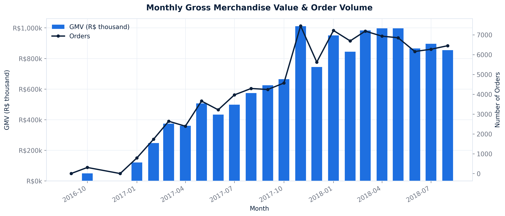
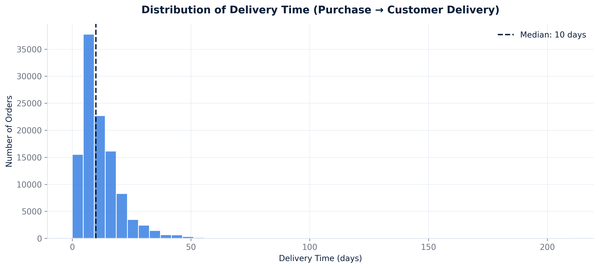
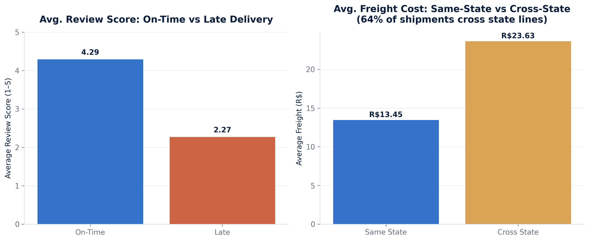
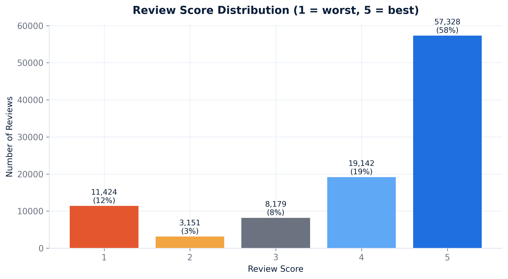
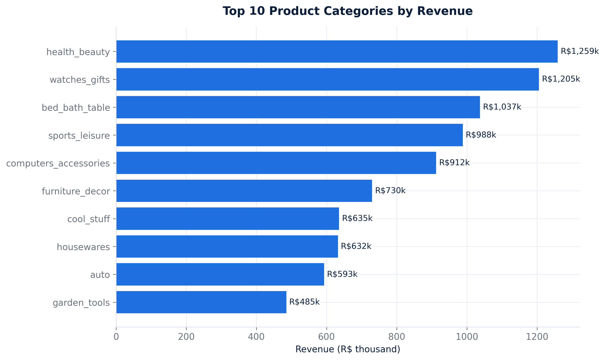
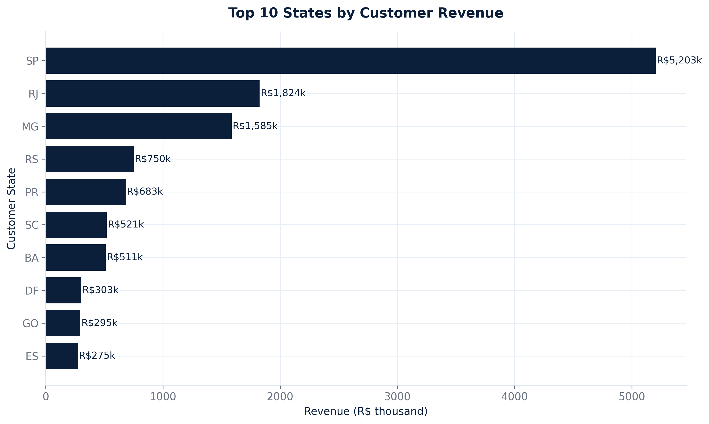
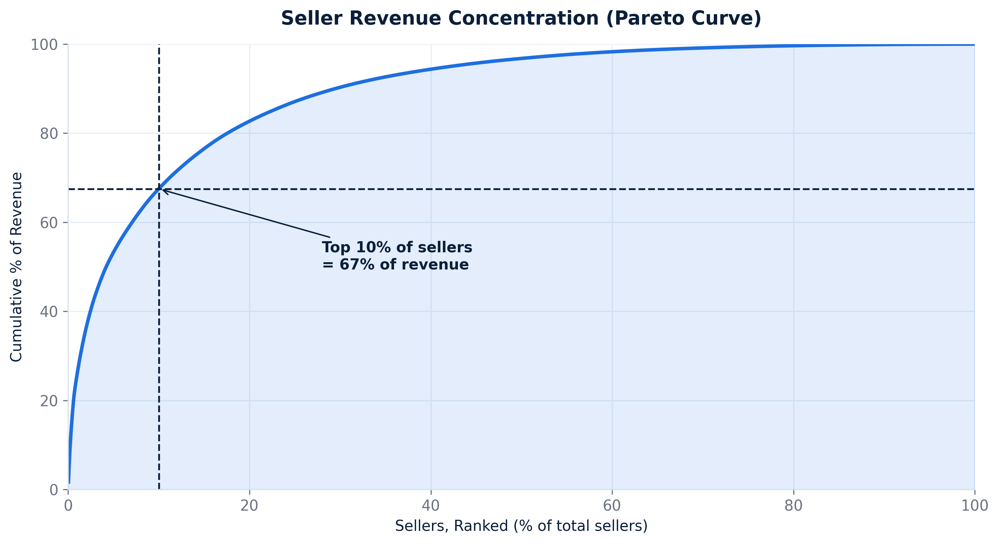
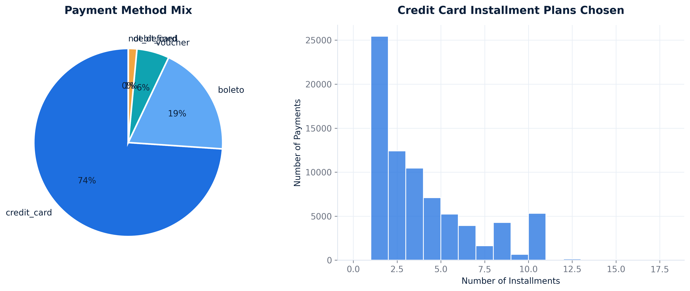

# 📊 Olist E-Commerce Business Analysis

## 📌 Project Overview

This project presents an end-to-end business analysis of the Brazilian Olist E-Commerce dataset.

The analysis explores sales performance, customer behavior, delivery efficiency, seller performance, product categories, and payment patterns to generate actionable business insights.

---

## 🎯 Objectives

The main objectives of this project are to:

- Analyze GMV and order trends over time
- Evaluate delivery performance
- Investigate the impact of delivery time and freight cost
- Analyze customer satisfaction through review scores
- Identify top-performing product categories
- Compare revenue across Brazilian states
- Analyze seller concentration
- Explore customer payment behavior

---

## 📂 Project Structure

```text
HVIA-Olist-Business-Analysis/
│
├── data/
│   ├── olist_customers_dataset.csv
│   ├── olist_geolocation_dataset.csv
│   ├── olist_order_items_dataset.csv
│   ├── olist_order_payments_dataset.csv
│   ├── olist_order_reviews_dataset.csv
│   ├── olist_orders_dataset.csv
│   ├── olist_products_dataset.csv
│   ├── olist_sellers_dataset.csv
│   └── product_category_name_translation.csv
│
├── figures/
│   ├── 01_monthly_gmv_orders.png
│   ├── 02_delivery_time_distribution.png
│   ├── 03_delivery_and_freight_impact.png
│   ├── 04_review_score_distribution.png
│   ├── 05_top_categories_revenue.png
│   ├── 06_top_states_revenue.png
│   ├── 07_seller_concentration_pareto.png
│   └── 08_payments_analysis.png
│
├── HVIA_Olist_Business_Discovery.ipynb
├── HVIA_Olist_Analysis_Results.xlsx
├── requirements.txt
├── .gitignore
└── README.md
```

---

## 📊 Analysis & Visualizations

### 1. Monthly GMV & Orders

Analysis of monthly Gross Merchandise Value (GMV) and order volume to identify business growth and sales trends.



---

### 2. Delivery Time Distribution

Analysis of delivery times to understand the overall logistics performance.



---

### 3. Delivery & Freight Impact

Analysis of how delivery performance and freight costs may affect the customer experience.



---

### 4. Customer Review Scores

Analysis of customer review score distribution to understand overall customer satisfaction.



---

### 5. Top Product Categories by Revenue

Identification of the product categories generating the highest revenue.



---

### 6. Top States by Revenue

Geographical analysis of revenue across Brazilian states.



---

### 7. Seller Concentration

Pareto analysis of sellers to determine whether revenue is concentrated among a relatively small number of sellers.



---

### 8. Payment Analysis

Analysis of customer payment methods and purchasing behavior.



---

## 🛠️ Technologies Used

- Python
- Pandas
- NumPy
- Matplotlib
- Jupyter Notebook
- Microsoft Excel

---

## 📁 Main Deliverables

### 📓 Jupyter Notebook

`HVIA_Olist_Business_Discovery.ipynb`

Contains the complete data preparation, analysis, visualization, and business discovery workflow.

### 📊 Excel Analysis

`HVIA_Olist_Analysis_Results.xlsx`

Contains the generated analysis results and business outputs.

---

## 🚀 How to Run the Project

### 1. Clone the repository

```bash
git clone https://github.com/YOUR_USERNAME/HVIA-Olist-Business-Analysis.git
```

### 2. Navigate to the project

```bash
cd HVIA-Olist-Business-Analysis
```

### 3. Install the required libraries

```bash
pip install -r requirements.txt
```

### 4. Run Jupyter Notebook

```bash
jupyter notebook
```

Then open:

`HVIA_Olist_Business_Discovery.ipynb`

---

## 💡 Business Value

This project demonstrates how raw e-commerce data can be transformed into meaningful insights related to:

- Revenue performance
- Customer satisfaction
- Logistics efficiency
- Product performance
- Seller concentration
- Geographic performance
- Payment behavior

These insights can support data-driven business decisions and help identify opportunities for operational and commercial improvement.

---

## 👩‍💻 Author

**Hager Amr**

Data & AI | Data Analysis | Machine Learning
